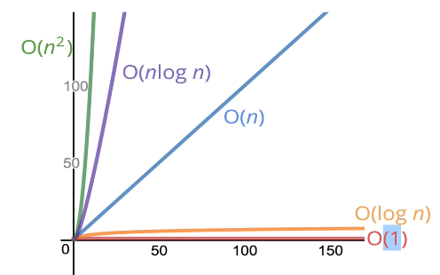

# Big O Notation
Metoda porownywania algorytmow

## Intuition
Lepszy gdy
* szybszy
* mniej pamieci

Nie mierzymy konkretnych sekund, bo to malo precyzyjne (roznice w wykonaniach, sprzecie itd.)
Mierzymy ilosc **prostych operacji**

```
def sumUpTo(n):
    out = 0
    for i in range(1,n+1):
        out += i
    return out
# dodawanie n razy, assignment n razy, n dodawanie i assignment w petli, n porownan. pojedyncze operacje pomijam
```
vs
```
def sumUpTo(n):
    return n * (n + 1) / 2
    # 3 operacje - mnozenie, dodawanie i dzielenie
```
Dokladna ilosc nie jest istotna. Interesuje nas trend - gdy n rosnie, jak rosnie ilosc operacji



## Formal definition (time complexity)
relacja miedzy inputem (rozmiarem) a czasem wykonania
`O (f(n))`
f(n) - liniowo gdy f(n) = n, kwadratowy gdy f(n)=n^2, staly =1, logarytmiczny itd.

Zawsze worst case scenario. Wiec pierwszy algorytm jest O(N), drugi O(1) (liniowy vs staly). Pomijamy stale typu 5n+2, n wystarczy

Zagniezdzone petle - kwadratowo, szesciennie itd.
```
def printAllPairs(n):
    for i in range(n):
        for j in range(n):
            print(i, j)
```
zewnetrzna O(n), wewnetrzna O(n) -> O(n*n)

## Upraszczanie BigO

* stale i male czynniki nie sa istotne, pomijamy jak wyzej
    * 5n+2 => n
    * O(500) -> O(1)
    * O(13n^2 + 50) -> O(n^2)
    * O(n^2 + 5n + 8) -> O(n^2) (n=1000000, czynnik liniowy niknie)
    * O(n^2 + n^3) -> O(n^3)
    * O(n + n + n + n) -> O(n)
    * O(n/2) -> O(n)
* operacje matematyczne, przypisania, porownania, dostep do pola obiektu albo tablicy maja stala zlozonosc
* petle - rozmiar petli, razy zlozonosc wewnatrz petli

```
# O(n)
# gdyby bylo min - O(1)
def printAtLeast5(n):
    for i in range(max(5, n)):
        print(i)
```

### Wzrost logarytmiczny
`log_a(b) = c => a^c = b`

Bardzo dobry algorytm. Baza pomijalna, wazny jest trend.
Jakie algorytmy maja log? Ogolna zasada log2: **ile razy mozesz podzielic na 2 zanim dostaniesz <= 1**

8 -> 4 -> 2 -> 1, czyli 3
jesli mamy jakies fajne zawezenie danych wejsciowych (jak binary search)

* czesc przeszukujach ma
* czesc sortujacych ma
* rekurencyjne czasem maja logarytmiczny space complexity

## Space complexity - pamiec
BigO mozna uzyc do analizy zuzytej pamieci. Nie przejmujemy sie wejsciem, tylko tym, co generuje sam algorytm (auxiliary space complexity)

* typy prymitywne - constant space
* stringi - O(n), gdzie n to dlugosc stringa
* obiekty/tablice - ilosc pol/elementow

```
# O(1) - mamy tylko stala, nie ma tablicy
def sumUpTo(n):
    out = 0
    for i in range(1,n+1):
        out += i
    return out
```

```
# O(n) - zwracamy tablice. Input nie jest tutaj wazny, sam algorytm zalokuje nowa tablice o dlugosci n
def double(tab):
    out = []
    for i in range(len(tab)):
        out.append(tab[i]*2)
    return out
```

## Typowe struktury
* Dictionary
    * insert/removal/access - O(1)
    * search for values - O(n)
    * list keys - O(n)
* Array
    * access - O(1)
    * search - O(n), ale sa rozne algorytmy
    * insert/removal - zalezy od miejsca dodania (na koncu szybciej) i prealokacji rozmiaru arraya
    * push, pop - O(1)
    * shift, sleice, foreach, map, concat - O(n)

