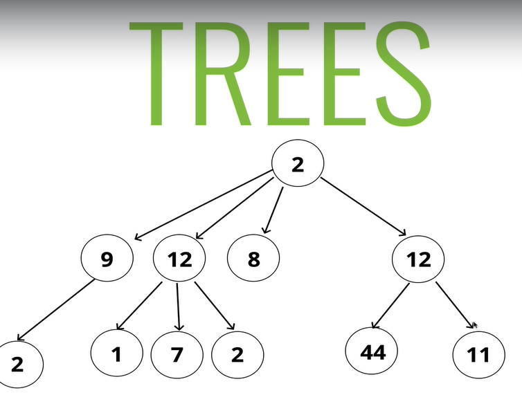

## Definitions
* `Drzewo` - nieliniowa (sa rozgalezienia) struktura z relacja rodzic-dziecko. 
    * Wezly nie moga wskazywac na inne wezly na tym samym poziomie (to jest graf) - zawsze poruszamy sie od roota. 
    * Root - top node. Jest tylko jeden
    * sibling - nodes with the same parent
    * leaf - node with no children
    * edge - connection between nodes
* `drzewo binarne` - drzewo z wezlami z dwojka (lub jednym) dzieci
* `binary search tree` - posortowane - w lewo mniejsza wartosc, w prawo wieksza
* `complete binary tree` - wszystkie (oprocz lisci) wezly sa osadzone

## Applications
* html dom/xmls
* json
* network routing (broadcasting, shortest path etc.)
* abstract syntax tree - describing syntax of programming language
* AI (min max alg, decision trees)
* file system
* ...