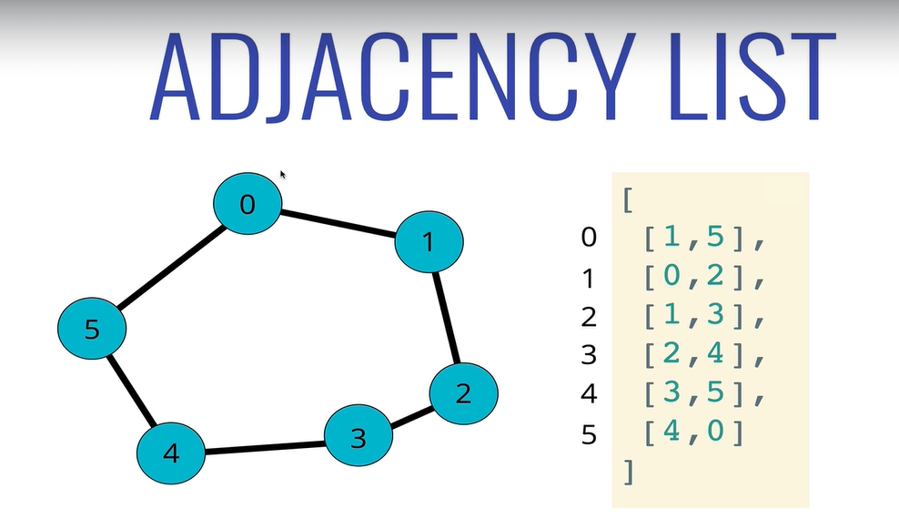
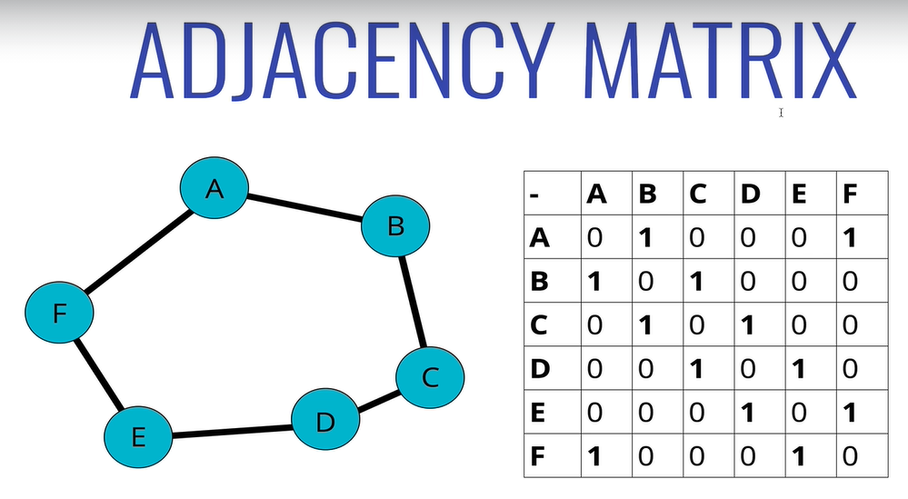

Graf - wezly z danymi + polaczenia. 

* vertex - node
* edge - connection

## Polaczenia:
* skierowane/nieskierowane. Skierowane - jednokierunkowe
* wazone/nie - czy polaczenie ma powiazane ze soba dane (np. kilometry drogi)

## Usage
Do modelowania wszelkich relacji miedzy danymi
* social networks
* recomendations (common categories between products)
* polaczenia miedzy stronami na wikipedii
* maps, roads, localisation
* routing
* visual hierarchy
* file system optimisations
* and more

# Model softwarowy

## adjacency list
lista polaczen przechowujemy pod danym indeksem z czym jest polaczenie, np. 3 z 2 i 4

Mozna tez uzyc hashTable - `node` : `[lista kluczy]`

## adjacency matrix
macierz true/false polaczen.

# BigO

`V` - number of vertices

`E` - number of edges

| operation      | adj list   | adj matrix |
|----------------|------------|------------|
| add vertex     | O(1)       |   O(V^2)   |
| add edge       |  O(1)      |    O(1)    |
| remove vertex  | O(V+E)     |  O(V^2)    |
| remove edge    |  O(E)      |     O(1)   |
| query          |  O(V+E)    |    O(1)    |
| storage        |  O(V+E)    |    O(V^2)  |

## lista - raczej czesciej uzywane, dane zazwyczaj sa sparse:
* `+` zajmuje mniej miejsca dla rzadkich grafow
* `+` szybsza iteracja po polaczeniach
* `-` wolne do szukania konkretnego polaczenia (trzeba przejsc po subliscie)

## macierz:
* `-` duzo miejsca dla rzadkich grafow
* `-` wolno iterujemy po polaczeniach (iterowanie przy braku polaczen)
* `+` szybki lookup konkretnego polaczenia (2 indeksy)

# Traversal
Visiting/updating/checking every node/searching nearest neighbours, finding paths.

Usage
* networking
* web crawler
* find closest match/recommendation
* shortest path
    * GPS
    * maze
    * AI - shortest path to win the game (min max in tictactoe)

There's no root -we need to specify start node.

Like trees (because trees are more special case of graph), we got 2 algorithms:
* `BFS ` - `breath first search` - expore neighbours first, then deep down
* `DFS` - `depth first search` - explore as far as possible down one branch before backtracking. Children before siblings